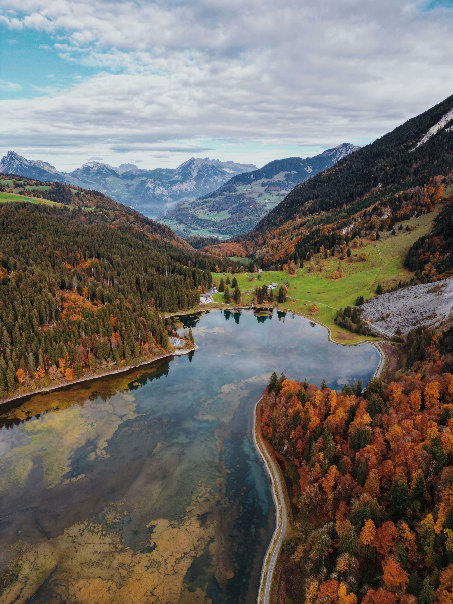
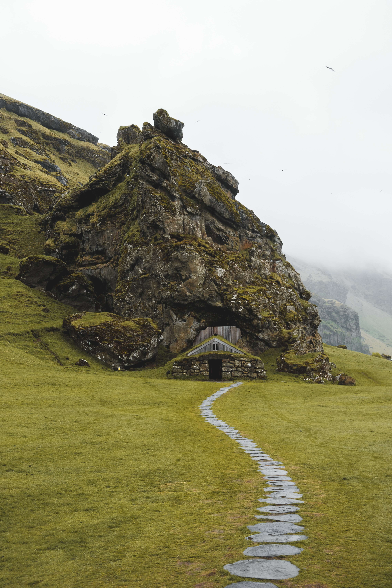
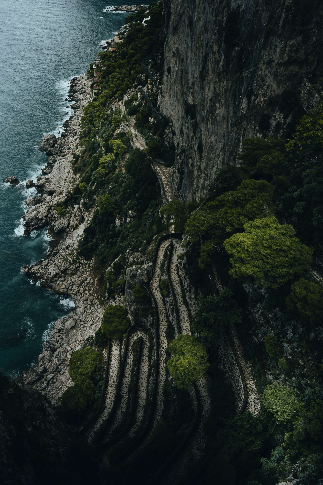

# **Проект Mesto**
Проектная работа от Яндекс Практикума

### Описание проекта
--------------------
Проект представляет собой интерактивную веб-страницу, в которой есть возможность редактировать свой профиль, включающий в себя поля "Имя" и "О себе", а также имеющий кнопку "Сохранить". Проект содержит красивые карточки с фотографиями и названиями различных уголков нашей планеты.
Целью данной работы была реализация всплывающего окна (pop-up), который должен открываться по нажатию кнопки "Редактировать" и закрываться при клике по крестику, создание адаптивной верстки и резиновой сетки, а также работа в различных ветках репозитория. Самое главное отличие этой работы от предыдущих это то, что в ней используется JavaScript, с помощью которого я реализовала функционал всплывающего окна. Появилась возможность вносить изменения в поля формы и обновлять их на странице. Также в этом проекте была тщательная работа в функциональных ветках, именование их, слияние и удаление ненужных, что пригодится в настоящей работе. Еще хочу отметить, что в данной работе я использовала новые свойства, которые помогают реализовать переполнение блоков с появляющимся многоточием в конце. Верстка осуществлялась по макету из графического редактора [Figma](https://www.figma.com/file/2cn9N9jSkmxD84oJik7xL7/JavaScript.-Sprint-4?node-id=0%3A1). Проект самостоятельно реализован с самого начала до конца, используемые в макете шрифты и картинки были загружены и подключены в необходимых файлах. Для оптимизации изображений я воспользовалась ресурсом [TinyPNG](https://tinypng.com/). Также я оптимизировала шрифты с помощью сглаживания.

### В проекте были использованы следующие технологии:
-----------------------------------------------------
* Методология БЭМ
* Организация файловой структуры Nested
* Резиновая и адаптивная верстка
* Flexbox верстка
* Технология Grid Layout
* Реализация pop-up и возможность его редактирования с помощью JS
-----------------------------------------------------------------
### Несколько картинок из проекта:

### Ссылка на сайт:
[https://lighttross.github.io/mesto/index.html]

### Рекомендации к использованию:
---------------------------------
Для работы и более детального ознакомления с этим проектом рекомендую клонировать его через git в локальный репозиторий.

### Планы по доработке проекта:
-------------------------------
* Применить функцию calc для большего количества элементов, улучшить код
* Проверить кроссбраузерность и прописать необходимые префиксы
* Прописать функционал для кнопок "like" и "add-button"
* Прописать код для сохранения редактируемой информации в профиле после перезагрузки страницы
